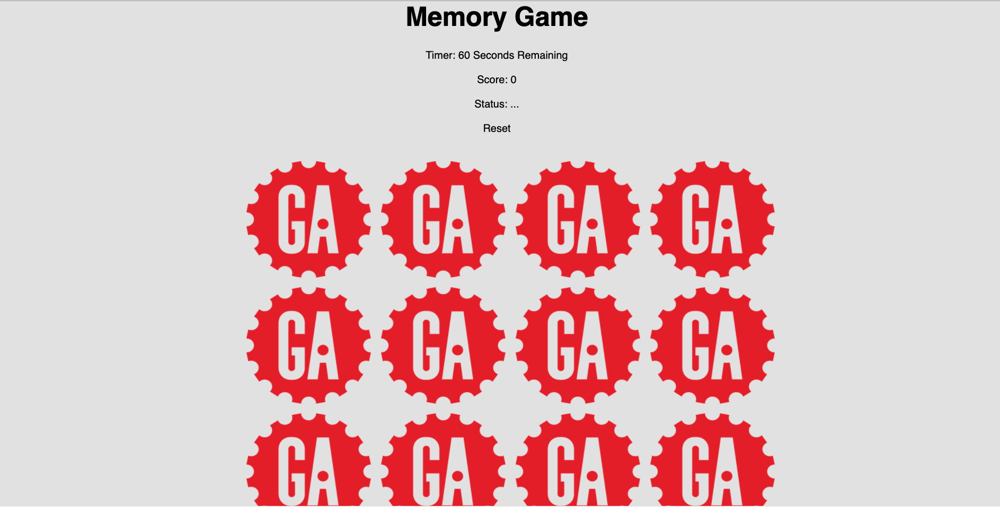
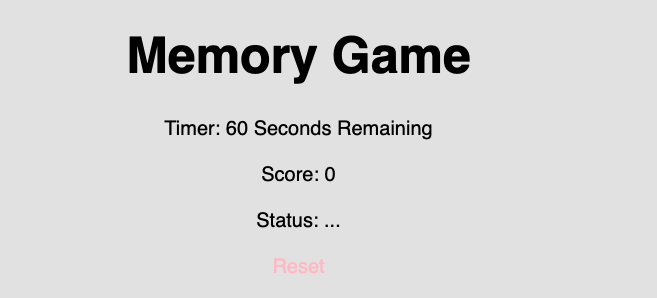
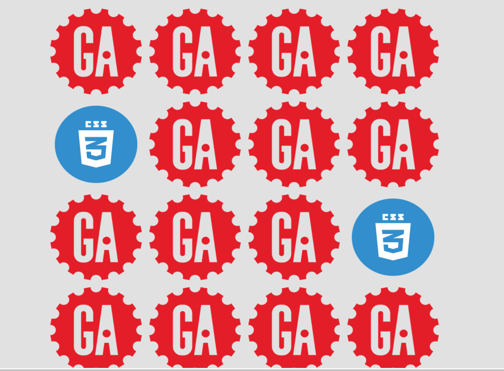
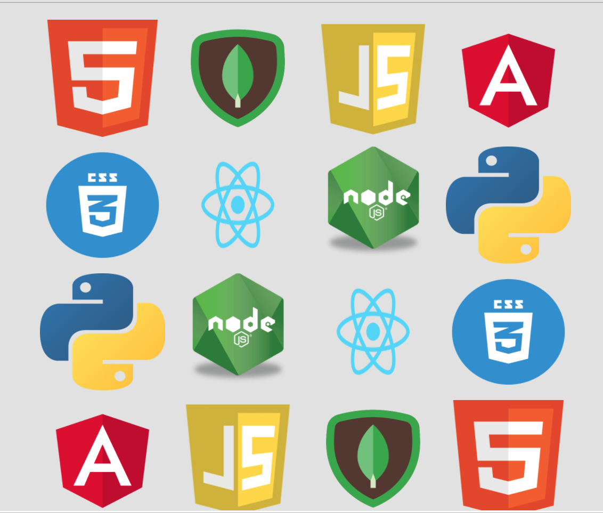

# Memory-Game

This is a memory game I created for my first project at General Assembly. When two cards are matched it will stay flipped, but if they aren't, it will flip back. The point of the game is to have all the cards flipped by the end of the 60 seconds.

<h2>Starting Page</h2>

<h2>Dashboard</h2>

<h2>When first pair is matched</h2>

<h2>When everything is matched</h2>

[Link to the game](https://jirehlau.github.io/Memory-Game/)

<h2>Technologies used</h2>
* HTML  
* CSS  
* JavaScript  

<h2>Next Steps</h2>
* Fix multiple bugs  
* Create animations for each flip  
* Add background sound effects so when a card is matched, it will make a sound
